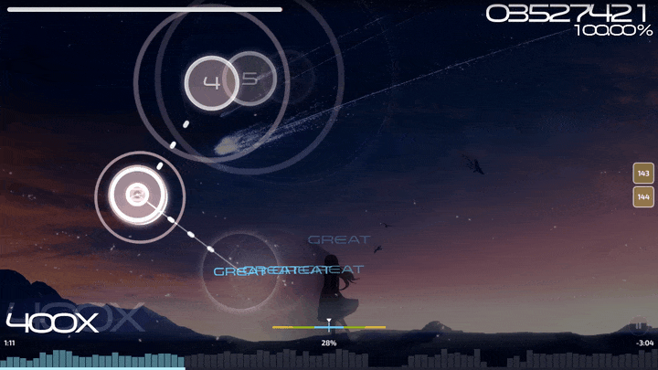

# wosu!

**Play it: [wosu.dino.icu](https://wosu.dino.icu)**

osu! is a rhythm game in which you click circles on the screen, following the rhythm of the music.

wosu! is an unofficial osu!std client that runs entirely in your browser, without any installation! Beatmaps come from mirrors like ([Sayobot](https://osu.sayobot.cn), [Mino](https://catboy.best), [NeriNyan](https://nerinyan.moe)) or you can upload your own `.osz` files.

wosu! is the successor to [WebOsu 2](https://github.com/WebOsu-2/webosu-2.github.io), itself a continuation of [the original WebOsu](https://github.com/111116/webosu). The classic WebOsu 2 is still online if your device struggles with wosu! or if you just prefer it.

Scoring and judgement follow osu!'s rules closely, but can still differ from official osu!; modes other than osu!std are not supported yet.



<sub>YOASOBI - Yoru ni Kakeru [Keirelia's Insane], mapped by [Petal](https://osu.ppy.sh/beatmapsets/1238759) (Autoplay).</sub>

## Features
- Base osu!std gameplay loop
- Mods: EZ, NF, HT, DC, HR, SD, PF, DT, NC, HD, FL, RX, AP, SO and Autoplay
- Download beatmaps in-game, with several default beatmaps and the option to import your own
- Full HUD with difficulty visualization bars, click counters, and more
- Extra configuration and features like background video, background dim/blur, mouse/keyboard/touch input, volume meters, notifications, a now-playing panel, and everything saved locally in your browser.

## Controls

| Action | Default |
| --- | --- |
| Hit | `Z` / `X`, mouse buttons, or tap |
| Pause | `Esc` (or hold the bottom-right button) |
| Skip intro | `Space` |
| Quick retry | hold `` ` `` |
| Cycle HUD visibility / peek at HUD | `Shift` + `Tab` / hold `Ctrl` |
| Mods / random beatmap (song select) | `F1` / `F2` |
| Settings / beatmap listing / notifications | `Ctrl+O` / `Ctrl+D` / `Ctrl+N` |
| Volume | `Alt` + mouse wheel, `Alt` + `↑`/`↓` |

Gameplay keys can be rebound in Settings → Input.

## Development

Requires Node.js 22 or newer.

```bash
npm install
npm run dev        # dev server with hot reload
npm test           # unit tests (Vitest)
npm run typecheck  # TypeScript
npm run build      # typecheck + production build into dist/
```

Every push and pull request runs CI (typecheck, tests, build). The site is hosted on [Vercel](https://vercel.com): pushes to `main` deploy to production, and pull requests get preview deployments. `dist/` is plain static files with relative paths, so it can be served from any host or sub-path.

See [CONTRIBUTING.md](CONTRIBUTING.md) for how to report bugs and send changes.

### Layout

| Path | What lives there |
| --- | --- |
| `src/app` | The Pixi application, layer stack, screen stack, overlays, music controller, background, cursors |
| `src/beatmap` | `.osu` parsing, slider curves, mod processing (stacking, combos, slider events), `.osz` archives, the local library, star ratings |
| `src/gameplay` | Rules and judgement (headless and unit tested), score/health processors, autoplay, input, hitsounds, playfield drawables and HUD |
| `src/graphics` | GPU slider renderer (shaders for WebGL and WebGPU) and texture helpers |
| `src/screens` | Intro, main menu, song select, player loader, player, results |
| `src/overlays` | Toolbar, settings, beatmap listing, mod select, notifications, now playing, volume, dialogs |
| `src/ui` | The small UI framework every screen is built from (buttons, text boxes, sliders, dropdowns, scroll containers, tooltips, triangles) |
| `src/audio`, `src/online`, `src/storage` | Web Audio engine, mirror APIs and downloads, IndexedDB storage |
| `public/assets` | Skin atlas, cursor textures, hitsounds and fonts; `art/sprites` holds the source sprites of the atlas |

## License notes

The code is MIT licensed. Some media files are copyrighted by [ppy](https://github.com/ppy/) and others; check their respective licenses before you use them. Exo 2 is licensed under the SIL Open Font License (see `public/assets/fonts/Exo2-OFL.txt`).

The menu cursor and cursor trail textures in `public/assets/skin/cursor/` come from [ppy/osu-resources](https://github.com/ppy/osu-resources) and are licensed under [CC BY-NC 4.0](https://creativecommons.org/licenses/by-nc/4.0/).

wosu! is not affiliated with or endorsed by ppy. osu! is a trademark of ppy Pty Ltd.
